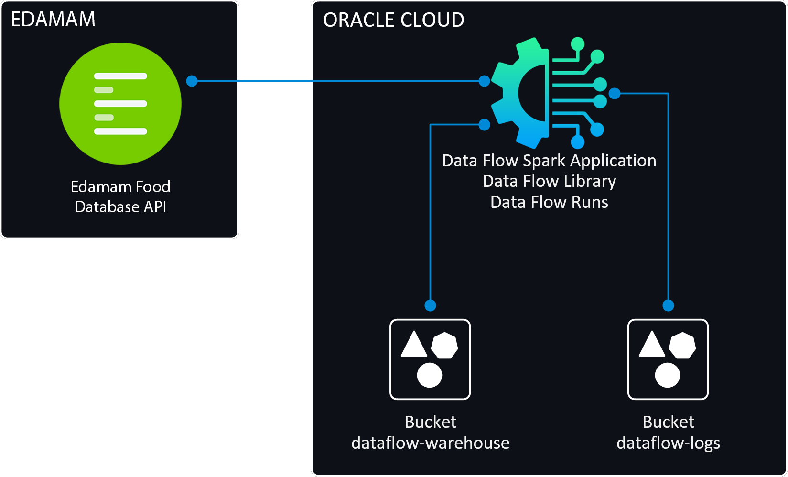
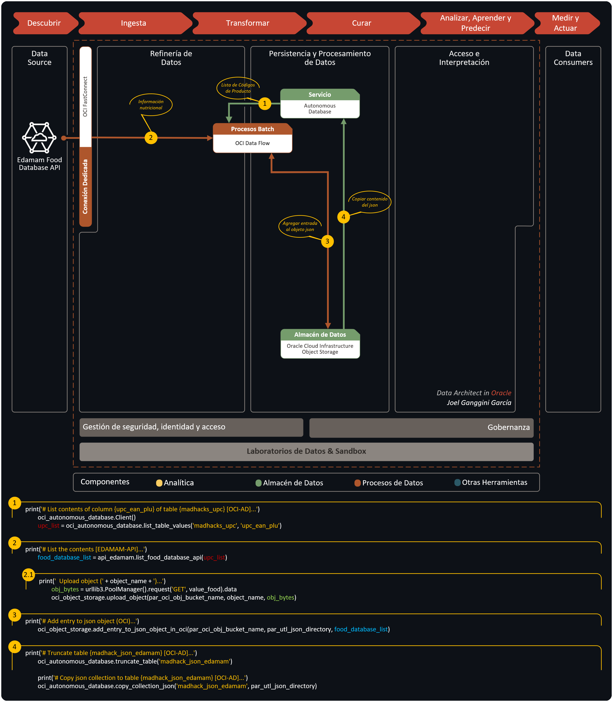
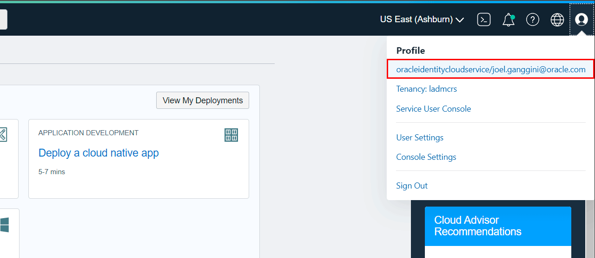
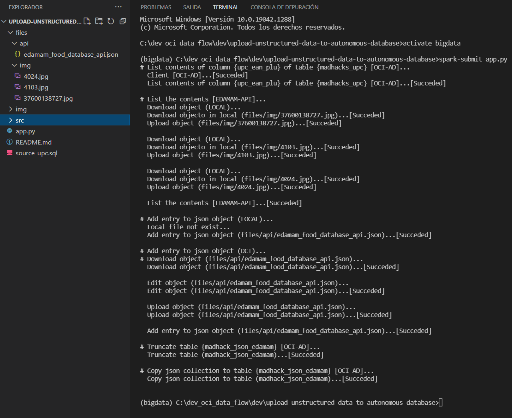
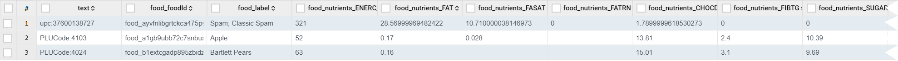
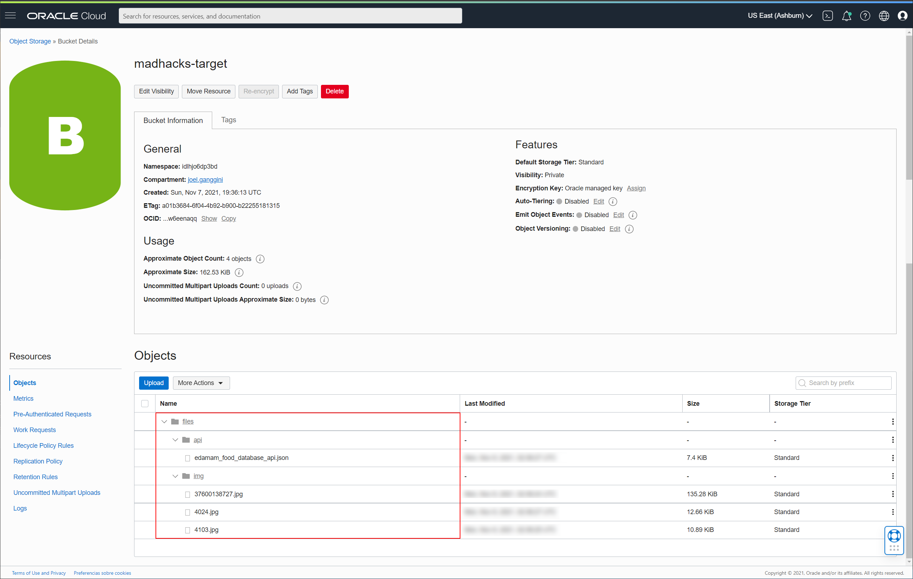
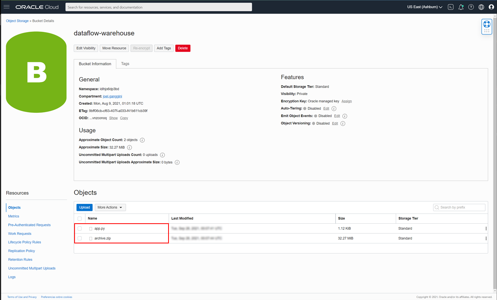
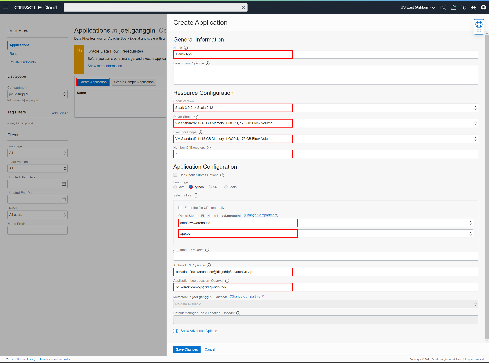
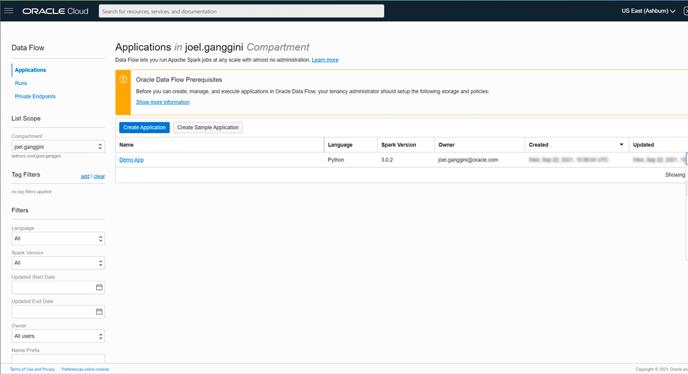
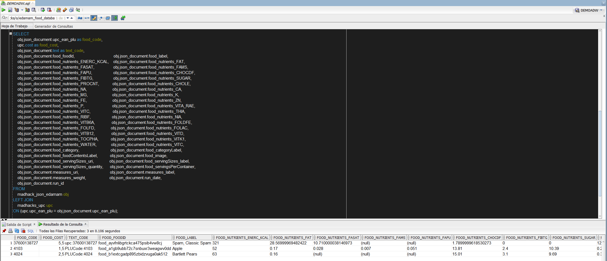

[![Issues][issues-shield]][issues-url]
[![LinkedIn][linkedin-shield]][linkedin-url]


<!-- PROJECT LOGO -->
<br />
<p align="center">
  

  <h3 align="center">OCI Data Flow</h3>

  <p align="center">
    Cargar datos no estructurados a Autonomous Database con OCI Data Flow
    <br />
    <a href="app.py"><strong>Explpore the code »</strong></a>
    <br />
    <br />
    <a href="https://youtu.be/GtWxaLPXqsQ?si=mxcw3QbJLRlo-vp5">🎬 View Demo</a>
    ·
    <a href="https://github.com/jganggini/oci/issues">Report Bug</a>
    ·
    <a href="https://github.com/jganggini/oci/issues">Request Feature</a>
  </p>
</p>

<!-- TABLE OF CONTENTS -->
<details open="open">
  <summary>Contenido</summary>
  <ol>
    <li><a href="#proyecto">Proyecto</a></li>
    <li>
        <a href="#descripción">Descripción</a>
        <ul>
            <li><a href="#config">Config</a></li>
            <li><a href="#parameters">Parameters</a></li>
        </ul>
    </li>
    <li><a href="#instalación">Instalación</a></li>
    <li><a href="#ejecución-local">Ejecución Local</a></li>
    <li><a href="#publicar-en-oci-data-flow">Publicar en OCI Data Flow</a></li>
    <li><a href="#ejecución-en-oci-data-flow">Ejecución en OCI Data Flow</a></li>
    <li><a href="#referencias">Referencias</a></li>
    <li><a href="#contacto">Contacto</a></li>
  </ol>
</details>

<!-- Proyecto -->
## Proyecto

El siguiente proyecto cubre la necesidad:
<ol>
    <li>Conectarnos a una API interactuando con Autonomous Database para realizar las consultas a la API enviando una lista de códigos de productos.</li>
    <li>
        Listar y preparar los resultados no estructurados en formato JSON enviados por la API.
        <ul>
            <li>Subir archivos PNG/JPG de forma recursiva a OCI Object Storage.</li>
        </ul>
    </li>
    <li>Subir un archivo JSON a OCI Object Storage.</li>
    <li>Subir el archivo publicado en OCI Object Storage a Autonomous Database.</li>
    <li><a href="#publicar-en-oci-data-flow">Publicar en OCI Data Flow</a></li>
    <li><a href="#ejecución-en-oci-data-flow">Ejecución en OCI Data Flow</a></li>
    <li><a href="#referencias">Referencias</a></li>
    <li><a href="#contacto">Contacto</a></li>
  </ol>

Para ello les comparto el paso a paso de cómo llegar a hacer estas integraciones rápidas en PySpark.

Otras aplicaciones:
* Source (`JDBC`)
* Target (`Parquet`/`AVRO`)

El siguiente diagrama ilustra esta arquitectura de referencia:

<p align="center">
    
</p>


<!-- Descripción -->
## Descripción

La aplicación está construida en base módulos y clases:

<p align="center">
  <a href="https://github.com/jganggini/oci-data-flow/blob/main/upload-unstructured-data-to-autonomous-database/app.py">
    
  </a>
</p>

<!-- Config -->
## Config

Los SDK y la CLI de Oracle Cloud Infrastructure requieren información de configuración básica, como las credenciales de usuario y el OCID de arrendamiento. [SDK and CLI Configuration File](https://docs.oracle.com/en-us/iaas/Content/API/Concepts/sdkconfig.htm)


<!-- Parameters -->
## Parameters

*   <u>Food Database API:</u></br>
    Agregamos los parámetros para conectarnos a `API Food Database API`:

    ```python
    # [Parameter:api_eda] Food Database API
    par_api_eda_app_id                 = '********'
    par_api_eda_app_key                = '********************************'
    ```

    Para mas información: https://developer.edamam.com/edamam-docs-recipe-api

*   <u>OCI Object Storage:</u></br>
    Agregamos los parámetros para conectarnos al `Bucket` en `OCI Object Storage`:

    ```python
    # [Parameter:oci_obj] OCI Object Storage
    par_oci_obj_bucket_name            = 'madhacks-target'
    # The profile parameter (ociProfileName) 'LOCAL' or 'DATAFLOW' in OCI
    par_oci_obj_ociProfileName         = 'LOCAL'
    par_oci_obj_ociConfigFilePath      = ('/opt/dataflow/python/lib/python3.6/site-packages/src/.oci/config' if par_oci_obj_ociProfileName=='DATAFLOW' else 'src/.oci/config')
    par_oci_obj_config                 = oci.config.from_file(par_oci_obj_ociConfigFilePath, par_oci_obj_ociProfileName)
    par_oci_obj_object_storage_client  = oci.object_storage.ObjectStorageClient(par_oci_obj_config)
    par_oci_obj_namespace_name         = par_oci_obj_object_storage_client.get_namespace().data
    ```

    *   Creamos el directeorio `./src/.oci/`

    *   Descargamos los siguientes archivos en `.oci`:
        *   oracleidentitycloudservice_joel.ganggini-09-20-23-15.pem
        *   oracleidentitycloudservice_joel.ganggini-09-20-23-15_public.pem
        *   config
                    
    *  Para ello ingresamos a nuestra cuenta de `OCI` y generamos el API Key:

       <p align="center">
         
       </p>
    
    *   Creamos el perfil `LOCAL` para realizar ejecuciones en nuestro ordenador y el perfil `DATAFLOW` para usarlo cuando subamos la aplicacion a `OCI Data Flow`. 

        ```python
        [LOCAL]
        user=ocid1.user.oc1..****************************************************
        fingerprint=**:**:**:**:**:**:**:**:**:**:**:**:**:**:**:**
        tenancy=ocid1.tenancy.oc1..****************************************************
        region=us-ashburn-1
        key_file=./src/.oci/oracleidentitycloudservice_joel.ganggini-09-20-23-15.pem

        [DATAFLOW]
        user=ocid1.user.oc1..****************************************************
        fingerprint=**:**:**:**:**:**:**:**:**:**:**:**:**:**:**:**
        tenancy=ocid1.tenancy.oc1..****************************************************
        region=us-ashburn-1
        key_file=/opt/dataflow/python/lib/python3.6/site-packages/src/.oci/oracleidentitycloudservice_joel.ganggini-09-20-23-15.pem
        ```
        `key_file`: El directorio `src` se subiran al zip `archive.zip` para que pueda los archivos puedan ser ser usado en OCI Data Flow.

*   <u>OCI Autonomous Database:</u></br>
    Agregamos los parámetros para generar el log de seguimiento de la migración:

    ```python
    # [Parameter:oci_adb] OCI Autonomous Database
    par_oci_adb_lib_dir                = ('/opt/dataflow/python/lib/python3.6/site-packages/src/.oci/instantclient_19_11' if par_oci_obj_ociProfileName=='DATAFLOW' else 'src/.oci/instantclient_19_11')
    par_oci_adb_user                   = 'admin'
    par_oci_adb_password               = '************'
    par_oci_adb_dsn                    = 'demoadw_high'
    par_oci_adb_credential             = 'OBJ_STORE_CRED'
    par_oci_adb_region                 = 'us-ashburn-1'

    # [Parameter:utl_json] Copy Json
    par_utl_json_object_name            = 'edamam_food_database_api.json'
    par_utl_json_directory              = 'files/api/' + par_utl_json_object_name

    # [Parameter:utl_dow] Download Object
    par_utl_dow_directory              = 'files/img/'
    ```

    Para mas información: https://oracle.github.io/python-cx_Oracle/samples/tutorial/Python-and-Oracle-Database-Scripting-for-the-Future.html

<!-- Instalación -->
## Instalación

*   Utilice el administrador de paquetes [pip](https://pip.pypa.io/en/stable/) para instalar las siguientes librerias:

    ```bash
    pip install oci
    pip install requests==2.14.2
    python -m pip install cx_Oracle --upgrade --user
    pip install urllib3
    ```


<!-- Ejecución Local-->
## Ejecución Local

*   `CMD`: Probamos nuestro código en local:

    ```cmd
    spark-submit app.py
    ```

*   `CMD`: Esperamos que termine de ejecutar la aplicación.

    <p align="center">
      
    </p>

*   Se genera el archivo `edamam_food_database_api.json` en modo local:

    ```json
    [{
      "upc_ean_plu": "37600138727",
      "text": "upc:37600138727",
      "food_foodId": "food_ayvfnlibgrtckca475psib4vw8cj",
      "food_label": "Spam, Classic Spam",
      "food_nutrients_ENERC_KCAL": 321,
      "food_nutrients_FAT": 28.56999969482422,
      "food_nutrients_FASAT": 10.710000038146973,
      "food_nutrients_FATRN": 0,
      "food_nutrients_CHOCDF": 1.7899999618530273,
      "food_nutrients_FIBTG": 0,
      "food_nutrients_SUGAR": 0,
      "food_nutrients_PROCNT": 12.5,
      "food_nutrients_CHOLE": 71,
      "food_nutrients_NA": 1411,
      "food_nutrients_CA": 0,
      "food_nutrients_FE": 0.6399999856948853,
      "food_nutrients_VITC": 0,
      "food_category": "Packaged foods",
      "food_categoryLabel": "food",
      "food_foodContentsLabel": "PORK WITH HAM; SALT; WATER; MODIFIED POTATO STARCH; SUGAR; SODIUM NITRITE",
      "food_image": "https://www.edamam.com/food-img/dc3/dc3c3eecb3b29c3c6c138a7559bb16c4.jpg",
      "food_servingSizes_uri": "http://www.edamam.com/ontologies/edamam.owl#Measure_ounce",
      "food_servingSizes_label": "Ounce",
      "food_servingSizes_quantity": 2,
      "food_servingsPerContainer": 6.000000000000001,
      "measures_uri": "http://www.edamam.com/ontologies/edamam.owl#Measure_kilogram",
      "measures_label": "Kilogram",
      "measures_weight": 1000,
      "run_date": "2021-11-07 21:36:21",
      "run_id": "20211107213621142920"
    },{
      "upc_ean_plu": "4103",
      "text": "PLUCode:4103",
      "food_foodId": "food_a1gb9ubb72c7snbuxr3weagwv0dd",
      "food_label": "Apple",
      "food_nutrients_ENERC_KCAL": 52,
      "food_nutrients_FAT": 0.17,
      "food_nutrients_FASAT": 0.028,
      "food_nutrients_FAMS": 0.007,
      "food_nutrients_FAPU": 0.051,
      "food_nutrients_CHOCDF": 13.81,
      "food_nutrients_FIBTG": 2.4,
      "food_nutrients_SUGAR": 10.39,
      "food_nutrients_PROCNT": 0.26,
      "food_nutrients_CHOLE": 0,
      "food_nutrients_NA": 1,
      "food_nutrients_CA": 6,
      "food_nutrients_MG": 5,
      "food_nutrients_K": 107,
      "food_nutrients_FE": 0.12,
      "food_nutrients_ZN": 0.04,
      "food_nutrients_P": 11,
      "food_nutrients_VITA_RAE": 3,
      "food_nutrients_VITC": 4.6,
      "food_nutrients_THIA": 0.017,
      "food_nutrients_RIBF": 0.026,
      "food_nutrients_NIA": 0.091,
      "food_nutrients_VITB6A": 0.041,
      "food_nutrients_FOLDFE": 3,
      "food_nutrients_FOLFD": 3,
      "food_nutrients_FOLAC": 0,
      "food_nutrients_VITB12": 0,
      "food_nutrients_VITD": 0,
      "food_nutrients_TOCPHA": 0.18,
      "food_nutrients_VITK1": 2.2,
      "food_nutrients_WATER": 85.56,
      "food_category": "Generic foods",
      "food_categoryLabel": "food",
      "food_image": "https://www.edamam.com/food-img/42c/42c006401027d35add93113548eeaae6.jpg",
      "measures_uri": "http://www.edamam.com/ontologies/edamam.owl#Measure_cup",
      "measures_label": "Cup",
      "measures_weight": 109,
      "run_date": "2021-11-07 21:36:21",
      "run_id": "20211107213621142920"
    },{
      "upc_ean_plu": "4024",
      "text": "PLUCode:4024",
      "food_foodId": "food_b1extcgadp895zbidzvuga0ak512",
      "food_label": "Bartlett Pears",
      "food_nutrients_ENERC_KCAL": 63,
      "food_nutrients_FAT": 0.16,
      "food_nutrients_CHOCDF": 15.01,
      "food_nutrients_FIBTG": 3.1,
      "food_nutrients_SUGAR": 9.69,
      "food_nutrients_PROCNT": 0.39,
      "food_nutrients_NA": 1,
      "food_nutrients_CA": 9,
      "food_nutrients_MG": 6,
      "food_nutrients_K": 101,
      "food_nutrients_FE": 0.19,
      "food_nutrients_ZN": 0.08,
      "food_nutrients_P": 11,
      "food_nutrients_VITA_RAE": 1,
      "food_nutrients_VITC": 4.4,
      "food_nutrients_THIA": 0.012,
      "food_nutrients_RIBF": 0.026,
      "food_nutrients_NIA": 0.164,
      "food_nutrients_VITB6A": 0.026,
      "food_nutrients_FOLFD": 6,
      "food_nutrients_TOCPHA": 0.12,
      "food_nutrients_VITK1": 3.8,
      "food_nutrients_WATER": 84.14,
      "food_category": "Generic foods",
      "food_categoryLabel": "food",
      "food_image": "https://www.edamam.com/food-img/e41/e413bcb1b88d65f77aebf1ff51bd20f8.jpg",
      "measures_uri": "http://www.edamam.com/ontologies/edamam.owl#Measure_cup",
      "measures_label": "Cup",
      "measures_weight": 140,
      "run_date": "2021-11-07 21:36:21",
      "run_id": "20211107213621142920"
    }]
    ```
*   El archiv `edamam_food_database_api.json` se publica en `Autonomous Database`:

    <p align="center">
      
    </p>

*   `OCI Bucket`: Se visualizan los archivos parquet en `madhacks-target`. 

    <p align="center">
      
    </p>


<!-- Publicar en OCI Data Flow -->
## Publicar en OCI Data Flow

*   Creamos el directeorio `./opt/dataflow/`

*   Generar el archivo de requerimientos en la ruta `./opt/dataflow/requerimient.txt`

    ```python
    pip freeze > ./opt/dataflow/requirements.txt
    
    cx-Oracle==8.3.0
    urllib3==1.26.6
    requests==2.12.5
    oci==2.45.1
    ```

*   Empaquetamos las dependencias de la aplicación en `archive.zip`

*   `PowerShell`: ingresamos a la ruta de nuestro proyecto y ejecutamos el siguiente comando:

    ```powershell
    cd \dev_oci_data_flow\dev\opt\dataflow
    docker run --rm -v ${PWD}:/opt/dataflow -it phx.ocir.io/oracle/dataflow/dependency-packager:latest
    ```
*   `PowerShell`: Esperamos que termine de generar el zip.

*   En el zip `archive.zip` copiamos el directorio `./src` en la ruta `./opt/dataflow/archive.zip/python/lib/python3.6/site-packages/`

*   `OCI Bucket`: publicamos los archivos `app.py` y `archive.zip` al Bucket `dataflow-warehouse`. 

    <p align="center">
      
    </p>

*   `OCI Data Flow`: creamos la aplicación `Demo App` increasando los siguientes campos:

    <p align="center">
      
    </p>

<!-- Ejecución Dataflow -->
## Ejecución en OCI Data Flow

*   `OCI Data Flow`: Selecionamos nuestra aplicación y ejecutamos:

    <p align="center">
      
    </p>

*   `OCI Bucket`: visualizamos el log generado en `dataflow-log`.

*   `OCI Bucket`: visualizamos el json generado en `edamam_food_database_api.json` en `madhacks-target`.

*   `Autonomous Database`: visualizamos la información cargada.

    ```sql
    SELECT
        obj.json_document.upc_ean_plu as food_code,
        upc.cost as food_cost,
        obj.json_document.text as text_code,              obj.json_document.food_foodId,              obj.json_document.food_label,
        obj.json_document.food_nutrients_ENERC_KCAL,      obj.json_document.food_nutrients_FAT,       obj.json_document.food_nutrients_FASAT,
        obj.json_document.food_nutrients_FAMS,            obj.json_document.food_nutrients_FAPU,      obj.json_document.food_nutrients_CHOCDF,
        obj.json_document.food_nutrients_FIBTG,           obj.json_document.food_nutrients_SUGAR,     obj.json_document.food_nutrients_PROCNT,
        obj.json_document.food_nutrients_CHOLE,           obj.json_document.food_nutrients_NA,        obj.json_document.food_nutrients_CA,
        obj.json_document.food_nutrients_MG,              obj.json_document.food_nutrients_K,         obj.json_document.food_nutrients_FE,
        obj.json_document.food_nutrients_ZN,              obj.json_document.food_nutrients_P,         obj.json_document.food_nutrients_VITA_RAE,
        obj.json_document.food_nutrients_VITC,            obj.json_document.food_nutrients_THIA,      obj.json_document.food_nutrients_RIBF,
        obj.json_document.food_nutrients_NIA,             obj.json_document.food_nutrients_VITB6A,    obj.json_document.food_nutrients_FOLDFE,
        obj.json_document.food_nutrients_FOLFD,           obj.json_document.food_nutrients_FOLAC,     obj.json_document.food_nutrients_VITB12,
        obj.json_document.food_nutrients_VITD,            obj.json_document.food_nutrients_TOCPHA,    obj.json_document.food_nutrients_VITK1,
        obj.json_document.food_nutrients_WATER,           obj.json_document.food_nutrients_VITC,      obj.json_document.food_category,
        obj.json_document.food_categoryLabel,             obj.json_document.food_foodContentsLabel,   obj.json_document.food_image,
        obj.json_document.food_servingSizes_uri,          obj.json_document.food_servingSizes_label,  obj.json_document.food_servingSizes_quantity,
        obj.json_document.food_servingsPerContainer,      obj.json_document.measures_uri,             obj.json_document.measures_label,
        obj.json_document.measures_weight,                obj.json_document.run_date,
        obj.json_document.run_id,
        obj.json_document.food_servingSizes_uri
    FROM
        madhack_json_edamam obj
    LEFT JOIN
        madhacks_upc upc
    ON (upc.upc_ean_plu = obj.json_document.upc_ean_plu);
    ```

    <p align="center">
      
    </p>

*   `OCI Data Flow`: Para mayor detalle de como configurar el enterno de desarrollo local y OCI Data Flow:

    <p align="center">
      <a href="https://youtu.be/GtWxaLPXqsQ?si=mxcw3QbJLRlo-vp5">
        
      </a>
    </p>

<!-- Referencias -->
## Referencias

*   [Welcome to cx_Oracle’s documentation!](https://cx-oracle.readthedocs.io/en/latest/)
*   [EDAMAM - API Developer Portal](https://developer.edamam.com/)
*   [DBMS_CLOUD Package Format Options](https://docs.oracle.com/en/cloud/paas/autonomous-database/adbsa/format-options.html#GUID-08C44CDA-7C81-481A-BA0A-F7346473B703)
*   [Oracle Cloud Infrastructure Documentation: SDK and CLI Configuration File:](https://docs.oracle.com/en-us/iaas/Content/API/Concepts/sdkconfig.htm)
*   [Oracle Cloud Infrastructure Documentation: put_object](https://docs.oracle.com/en-us/iaas/tools/python-sdk-examples/2.45.1/objectstorage/put_object.py.html)
*   [Oracle Cloud Infrastructure Documentation: Biblioteca de Data Flow](https://docs.oracle.com/es-ww/iaas/data-flow/using/dfs_data_flow_library.htm)

<!-- MARKDOWN LINKS & IMAGES -->
<!-- https://www.markdownguide.org/basic-syntax/#reference-style-links -->
[issues-shield]: https://img.shields.io/github/issues/othneildrew/Best-README-Template.svg?style=for-the-badge
[issues-url]: https://github.com/jganggini/oci/issues
[linkedin-shield]: https://img.shields.io/badge/-LinkedIn-black.svg?style=for-the-badge&logo=linkedin&colorB=555
[linkedin-url]: https://www.linkedin.com/in/jganggini/