[![Issues][issues-shield]][issues-url]
[![LinkedIn][linkedin-shield]][linkedin-url]


<!-- PROJECT LOGO -->
<br />
<p align="center">
  

  <h3 align="center">OCI Data Flow</h3>

  <p align="center">
    Migrar Datos de Azure Data Lake Storage a OCI Object Storage
    <br />
    <a href="app.py"><strong>Explore the code »</strong></a>
    <br />
    <br />
    <a href="https://youtube.com/playlist?list=PLMUWTQHw13gYmN2eigAJeylNxjL4f6rt5&si=sMK95si68djRbMK6">🎬 View Demo</a>
    ·
    <a href="https://github.com/jganggini/oci/issues">Report Bug</a>
    ·
    <a href="https://github.com/jganggini/oci/issues">Request Feature</a>
  </p>
</p>


<!-- Content -->
<details open="open">
  <summary>Contenido</summary>
  <ol>
    <li><a href="#proyecto">Proyecto</a></li>
    <li>
        <a href="#descripción">Descripción</a>
        <ul>
            <li><a href="#config">Config</a></li>
            <li><a href="#parameters">Parameters</a></li>
        </ul>
    </li>
    <li><a href="#instalación">Instalación</a></li>
    <li><a href="#ejecución-local">Ejecución Local</a></li>
    <li><a href="#publicar-en-oci-data-flow">Publicar en OCI Data Flow</a></li>
    <li><a href="#ejecución-en-oci-data-flow">Ejecución en OCI Data Flow</a></li>
    <li><a href="#referencias">Referencias</a></li>
    <li><a href="#contacto">Contacto</a></li>
  </ol>
</details>

<!-- Project -->
## Proyecto

El siguiente proyecto cubre la necesidad de migrar los datos de alta volumetría en formato parquet ubicados en Azure Data Lake Storage Gen2 a OCI Object Storage para dar continuidad a los proyectos en `OCI Lake House`.

Para ello les comparto el paso a paso de cómo llegar a hacer estas integraciones rápidas en PySpark gracias a los SDK sin necesidad de realizar mapeos o seguimiento de los directorios existentes.

Otras aplicaciones:
* Cloud2OCI (`AWS`/`GCP`/`Azure`)
* OnPremise2OCI (`Cloudera`/`Haddop`)

El siguiente diagrama ilustra esta arquitectura de referencia:

<p align="center">
    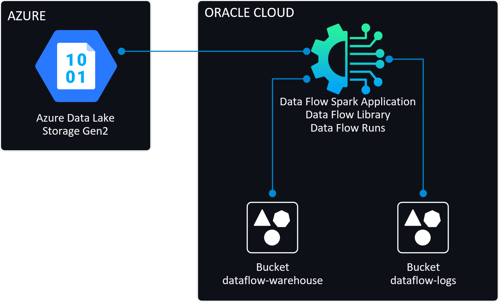
</p>


<!-- Descripción -->
## Descripción

La aplicación está construida en base módulos y clases:

<p align="center">
    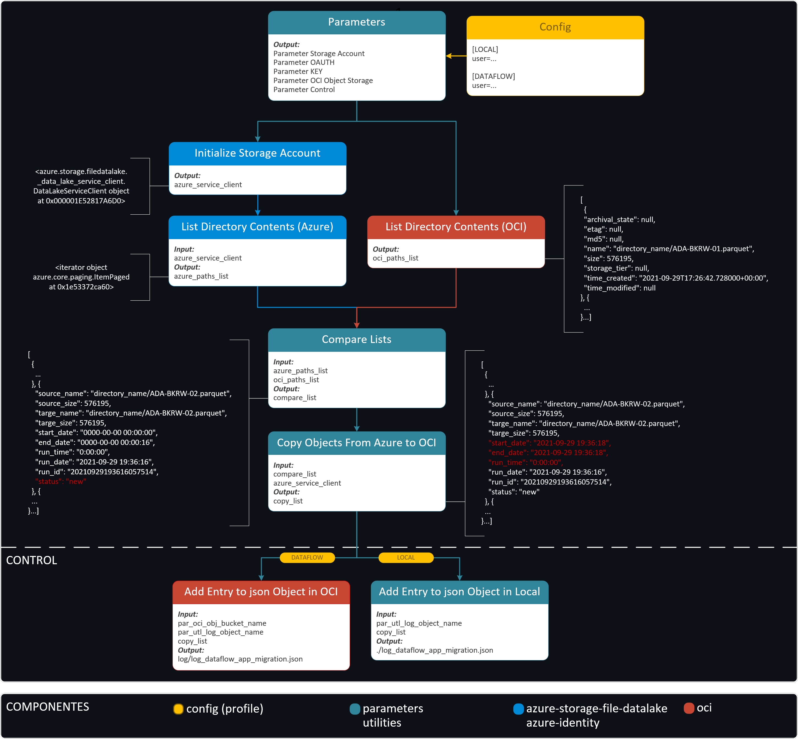
</p>


<!-- Config -->
## Config

Los SDK y la CLI de Oracle Cloud Infrastructure requieren información de configuración básica, como las credenciales de usuario y el OCID de arrendamiento. [SDK and CLI Configuration File](https://docs.oracle.com/en-us/iaas/Content/API/Concepts/sdkconfig.htm)


<!-- Parameters -->
## Parameters

*   <u>Storage Account:</u></br>
    Agregamos los parámetros para conectarnos a `Azure Data Lake Storage`:

    ```python
    # [Parameter:az_sac] Storage Account
    par_az_sac_storage_account_name    = 'sourcedemo'
    par_az_sac_file_system             = 'parquetfiles'
    par_az_sac_path                    = ''
    par_az_sac_file_directory          = '.'
    ```

    <p align="center">
        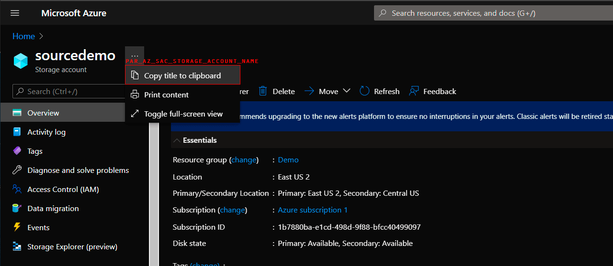
    </p>

*   <u>OAUTH:</u></br>
    Agregamos los parámetros para conectarnos mediante `OAUTH`:

    ```python
    # [Parameter:az_oau] OAUTH
    par_az_oau                         = False
    par_az_oau_tenant_id               = '********-****-****-****-***********'
    par_az_oau_client_id               = '********-****-****-****-***********'
    par_az_oau_client_secret           = '********-**********.******'
    ```

    Si nos conectamos mediante `OAUTH` el parametro `par_az_oau` debe ser `True`

*   <u>KEY:</u></br>
    Agregamos los parámetros para conectarnos mediante `KEY`:

    ```python
    # [Parameter:az_key] KEY
    par_az_key_storage_account_key     = '3MKEQ7dBY4e6xeIsw4uEBXR9gG1QuZa2T64uoNyyktINq...'
    ```
    Para configurar los parámetros de Key Value ingresamos a nuestra cuenta de Azure

    <p align="center">
      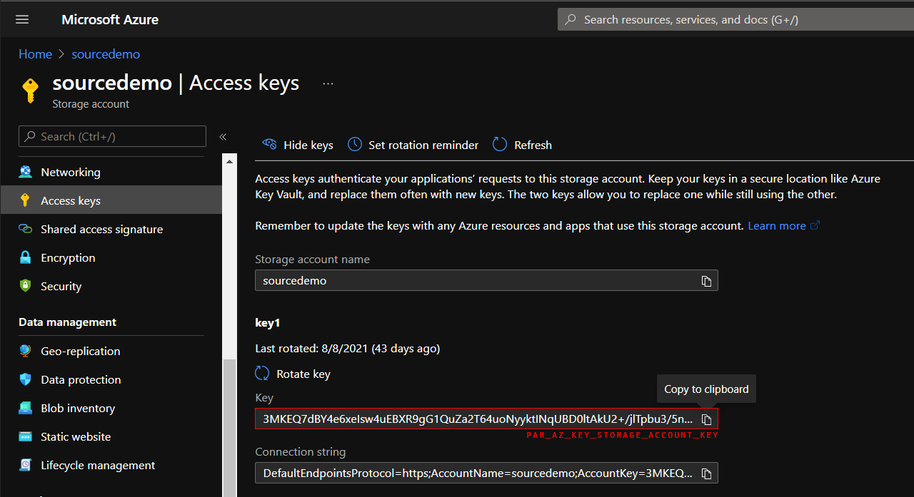
    </p>

    Si nos conectamos mediante `KEY` el parametro `par_az_oau` debe ser `False`

*   <u>OCI Object Storage:</u></br>
    Agregamos los parámetros para conectarnos al `Bucket` en `OCI Object Storage`:

    ```python
    # [Parameter:oci_obj] OCI Object Storage
    par_oci_obj_bucket_name            = 'target-azure'
    # The profile parameter (ociProfileName) 'LOCAL' or 'DATAFLOW' in OCI
    par_oci_obj_ociProfileName         = 'LOCAL'
    par_oci_obj_ociConfigFilePath      = ('/opt/dataflow/python/lib/python3.6/site-packages/src/.oci/config' if par_oci_obj_ociProfileName=='DATAFLOW' else './src/.oci/config')
    par_oci_obj_config                 = oci.config.from_file(par_oci_obj_ociConfigFilePath, par_oci_obj_ociProfileName)
    par_oci_obj_object_storage_client  = oci.object_storage.ObjectStorageClient(par_oci_obj_config)
    par_oci_obj_namespace_name         = par_oci_obj_object_storage_client.get_namespace().data
    ```

    *   Creamos el directeorio `./src/.oci/`

    *   Descargamos los siguientes archivos en `.oci`:
        *   oracleidentitycloudservice_joel.ganggini-09-20-23-15.pem
        *   oracleidentitycloudservice_joel.ganggini-09-20-23-15_public.pem
        *   config
                    
    *  Para ello ingresamos a nuestra cuenta de `OCI` y generamos el API Key:

       <p align="center">
         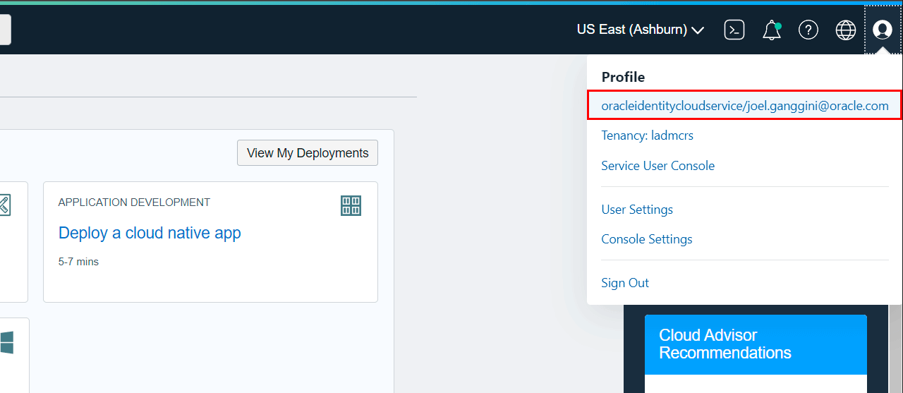
       </p>
    
    *   Creamos el perfil `LOCAL` para realizar ejecuciones en nuestro ordenador y el perfil `DATAFLOW` para usarlo cuando subamos la aplicacion a `OCI Data Flow`. 

        ```python
        [LOCAL]
        user=ocid1.user.oc1..****************************************************
        fingerprint=**:**:**:**:**:**:**:**:**:**:**:**:**:**:**:**
        tenancy=ocid1.tenancy.oc1..****************************************************
        region=us-ashburn-1
        key_file=./src/.oci/oracleidentitycloudservice_joel.ganggini-09-20-23-15.pem

        [DATAFLOW]
        user=ocid1.user.oc1..****************************************************
        fingerprint=**:**:**:**:**:**:**:**:**:**:**:**:**:**:**:**
        tenancy=ocid1.tenancy.oc1..****************************************************
        region=us-ashburn-1
        key_file=/opt/dataflow/python/lib/python3.6/site-packages/src/.oci/oracleidentitycloudservice_joel.ganggini-09-20-23-15.pem
        ```
        `key_file`: El directorio `src` se subiran al zip `archive.zip` para que pueda los archivos puedan ser ser usado en OCI Data Flow.

*   <u>Control:</u></br>
    Agregamos los parámetros para generar el log de seguimiento de la migración:

    ```python
    # [Parameter:utl_log] Control
    par_utl_log_bucket_name            = 'target-azure'
    par_utl_log_object_name            = ('log/log_dataflow_app_migration.json' if par_oci_obj_ociProfileName=='DATAFLOW' else './log_dataflow_app_migration.json')
    ```
    Si el perfil seleccionado es el parametro `par_oci_obj_ociProfileName` es `LOCAL` se generara en nuestro ordenador, si el perfil es `DATAFLOW` se generara en la ruta del bucket selecionado en el parametro `par_utl_log_bucket_name`.


<!-- Instalación -->
## Instalación

*   Utilice el administrador de paquetes [pip](https://pip.pypa.io/en/stable/) para instalar las siguientes librerias:

    ```bash
    pip install azure-storage-file-datalake
    pip install azure-identity
    pip install oci
    pip install requests==2.14.2
    ```


<!-- Ejecución Local-->
## Ejecución Local

*   `CMD`: Probamos nuestro código en local:

    ```cmd
    spark-submit app.py
    ```

*   `CMD`: Esperamos que termine de ejecutar la aplicación.

    <p align="center">
      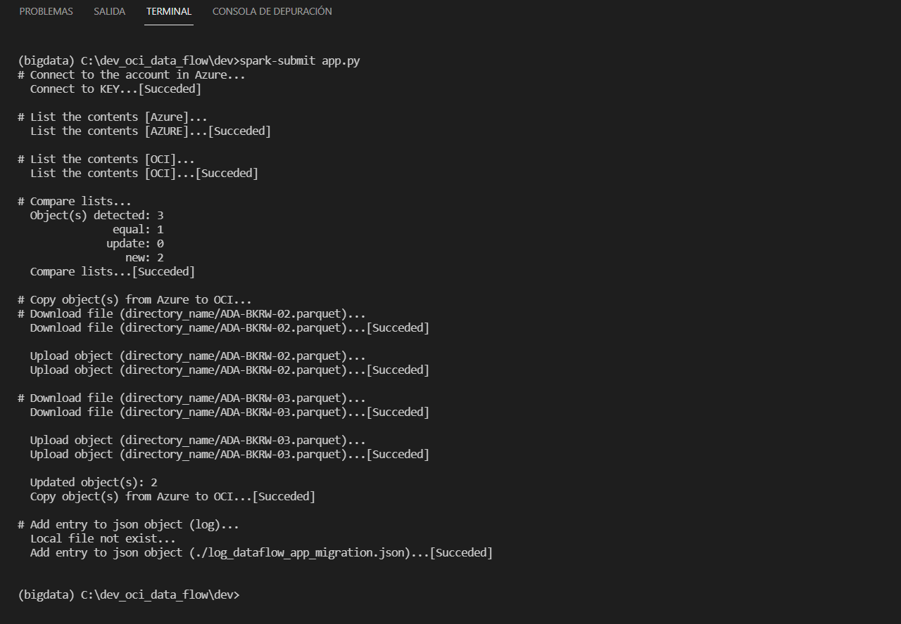
    </p>

*   Se genera el archivo `log_dataflow_app_migration.json` en modo local:

    ```json
    [{
      "source_name": "directory_name/ADA-BKRW-01.parquet",
      "source_size": 576195,
      "targe_name": "directory_name/ADA-BKRW-01.parquet",
      "targe_size": 576195,
      "start_date": "2021-09-30 11:12:13",
      "end_date": "2021-09-30 11:12:13",
      "run_time": "0:00:00",
      "run_date": "2021-09-30 11:12:13",
      "run_id": "20210930111213834758",
      "status": "equal"
    }, {
      "source_name": "directory_name/ADA-BKRW-02.parquet",
      "source_size": 576195,
      "targe_name": "directory_name/ADA-BKRW-01.parquet",
      "targe_size": 576195,
      "start_date": "2021-09-30 11:12:13",
      "end_date": "2021-09-30 11:12:15",
      "run_time": "0:00:02",
      "run_date": "2021-09-30 11:12:13",
      "run_id": "20210930111213834758",
      "status": "new"
    }, {
      "source_name": "directory_name/ADA-BKRW-03.parquet",
      "source_size": 576195,
      "targe_name": "directory_name/ADA-BKRW-01.parquet",
      "targe_size": 576195,
      "start_date": "2021-09-30 11:12:15",
      "end_date": "2021-09-30 11:12:16",
      "run_time": "0:00:00",
      "run_date": "2021-09-30 11:12:13",
      "run_id": "20210930111213834758",
      "status": "new"
    }]
    ```
*   El archiv `log_dataflow_app_migration.json` se puede publicar en `Autonomous Data Warehouse`:

    <p align="center">
      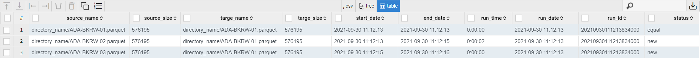
    </p>

*   `OCI Bucket`: Se visualizan los archivos parquet en `target-azure`. 

    <p align="center">
      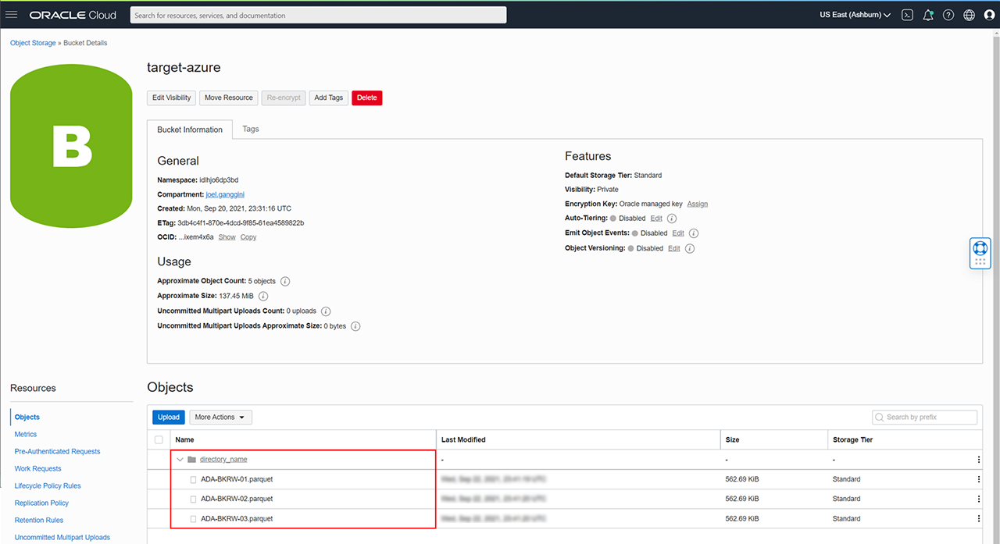
    </p>


<!-- Publicar en OCI Data Flow -->
## Publicar en OCI Data Flow

*   Creamos el directeorio `./opt/dataflow/`

*   Generar el archivo de requerimientos en la ruta `./opt/dataflow/requerimient.txt`

    ```python
    pip freeze > ./opt/dataflow/requirements.txt
    
    azure-storage-file-datalake==12.4.0
    azure-identity==1.6.1
    requests==2.12.5
    oci==2.45.1
    ```

*   Empaquetamos las dependencias de la aplicación en `archive.zip`

*   `PowerShell`: ingresamos a la ruta de nuestro proyecto y ejecutamos el siguiente comando:

    ```powershell
    cd \dev_oci_data_flow\dev\opt\dataflow
    docker run --rm -v ${PWD}:/opt/dataflow -it phx.ocir.io/oracle/dataflow/dependency-packager:latest
    ```
*   `PowerShell`: Esperamos que termine de generar el zip.

    <p align="center">
      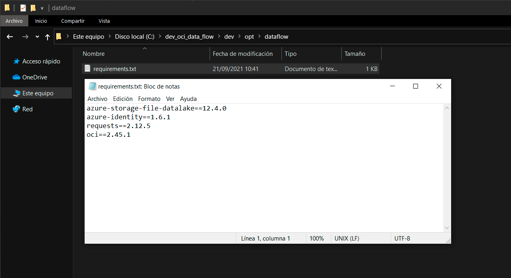
    </p>

*   En el zip `archive.zip` copiamos el directorio `./src` en la ruta `./opt/dataflow/archive.zip/python/lib/python3.6/site-packages/`

    <p align="center">
      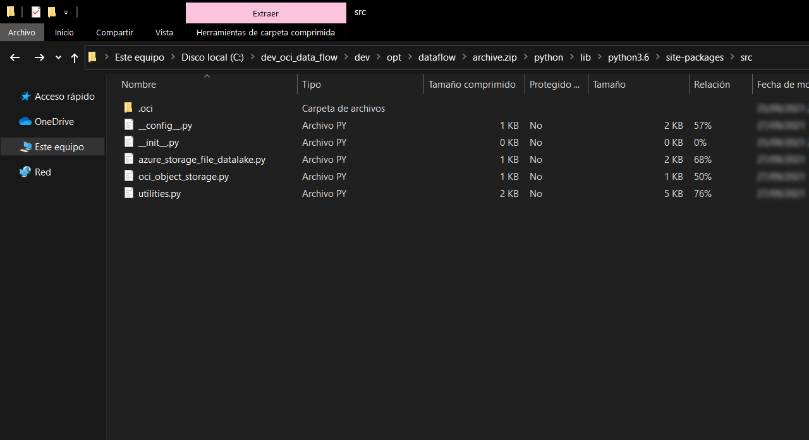
    </p>

*   `OCI Bucket`: publicamos los archivos `app.py` y `archive.zip` al Bucket `dataflow-warehouse`. 

    <p align="center">
      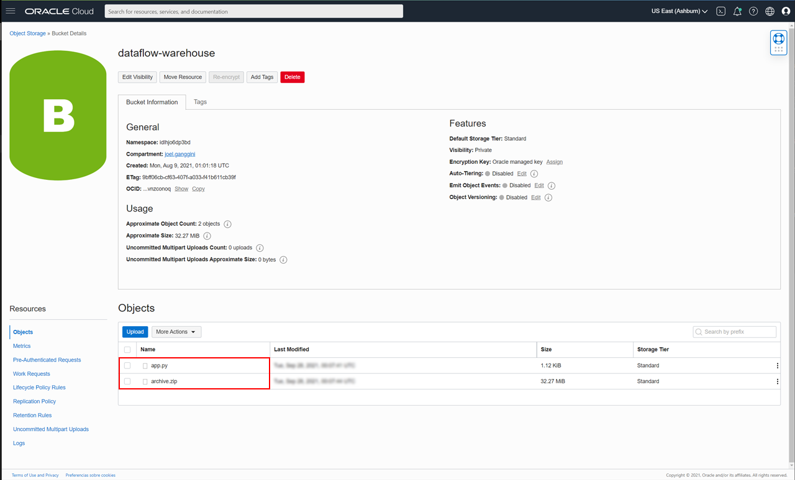
    </p>

*   `OCI Data Flow`: creamos la aplicación `Demo App` increasando los siguientes campos:

    <p align="center">
      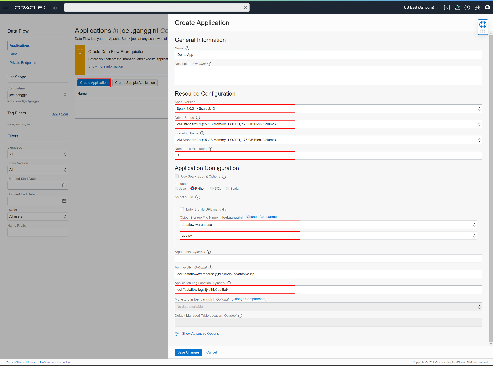
    </p>

<!-- Ejecución Dataflow -->
## Ejecución en OCI Data Flow

*   `OCI Data Flow`: Selecionamos nuestra aplicación y ejecutamos:

    <p align="center">
      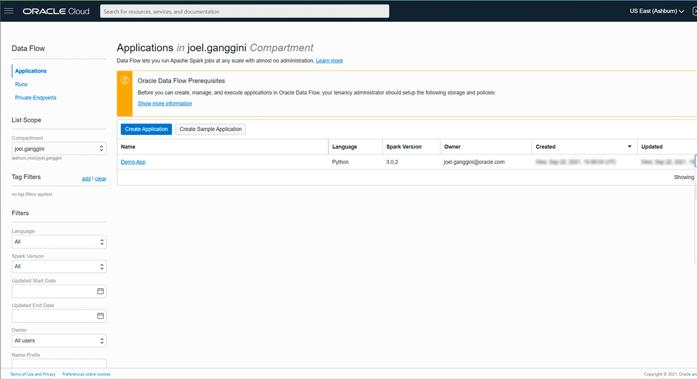
    </p>

*   `OCI Bucket`: visualizamos el log generado en `dataflow-log`.

    <p align="center">
      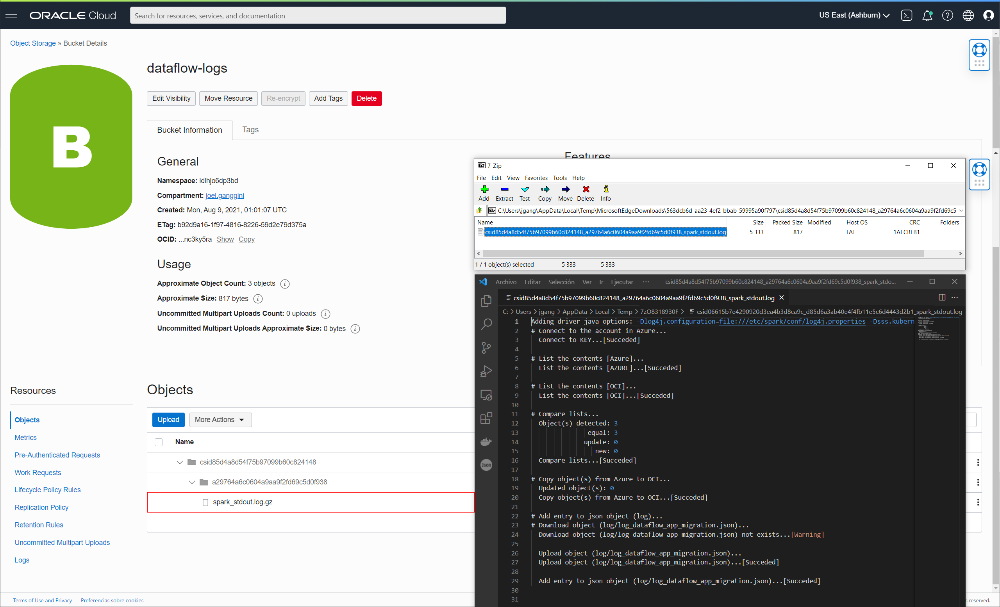
    </p>

*   `OCI Bucket`: visualizamos el log generado en `log_dataflow_app_migration.json` en `target-azure`.

    <p align="center">
        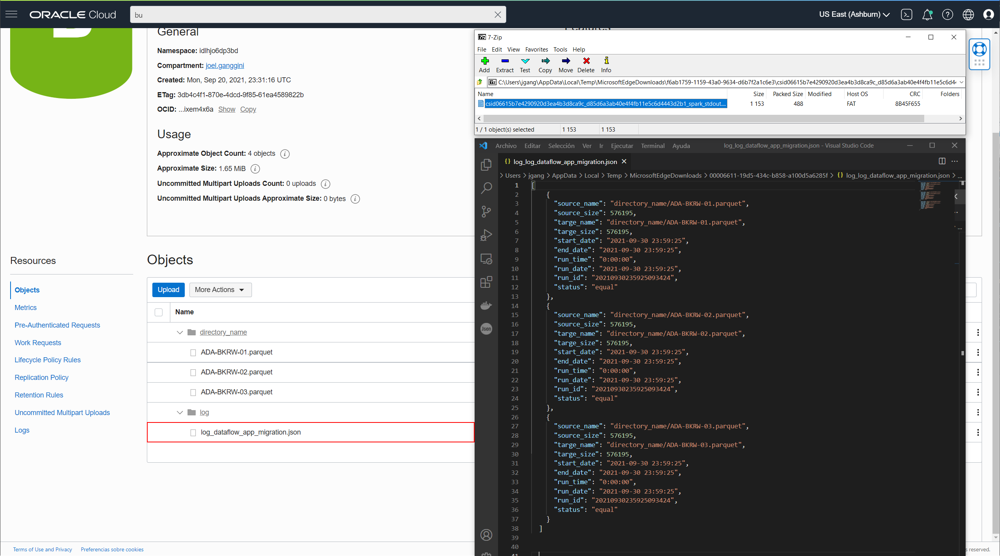
    </p>

*   `OCI Data Flow`: Para mayor detalle de como configurar el enterno de desarrollo local y OCI Data Flow:

    <p align="center">
      <a href="https://youtu.be/GtWxaLPXqsQ?si=mxcw3QbJLRlo-vp5">
        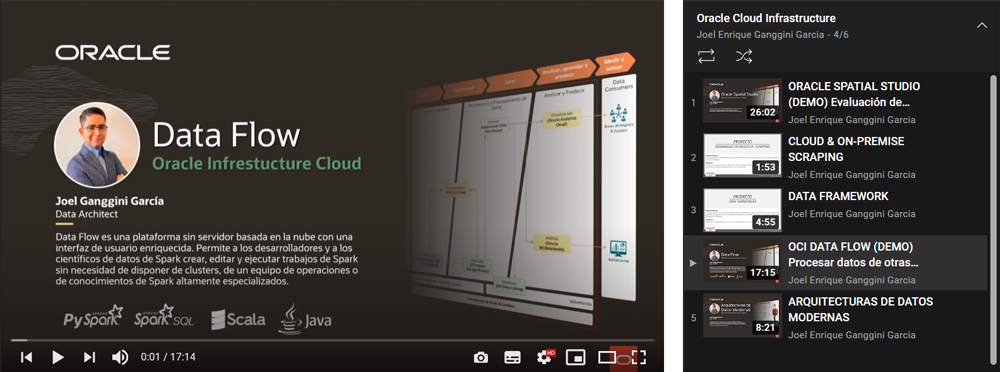
      </a>
    </p>
 

<!-- Referencias -->
## Referencias

*   [Use Python to manage directories and files in Azure Data Lake Storage Gen2](https://docs.microsoft.com/en-us/azure/storage/blobs/data-lake-storage-directory-file-acl-python)
*   [Oracle Cloud Infrastructure Documentation: SDK and CLI Configuration File:](https://docs.oracle.com/en-us/iaas/Content/API/Concepts/sdkconfig.htm)
*   [Oracle Cloud Infrastructure Documentation: put_object](https://docs.oracle.com/en-us/iaas/tools/python-sdk-examples/2.45.1/objectstorage/put_object.py.html)
*   [Oracle Cloud Infrastructure Documentation: Biblioteca de Data Flow](https://docs.oracle.com/es-ww/iaas/data-flow/using/dfs_data_flow_library.htm)


<!-- MARKDOWN LINKS & IMAGES -->
<!-- https://www.markdownguide.org/basic-syntax/#reference-style-links -->
[issues-shield]: https://img.shields.io/github/issues/othneildrew/Best-README-Template.svg?style=for-the-badge
[issues-url]: https://github.com/jganggini/oci-data-flow/issues
[linkedin-shield]: https://img.shields.io/badge/-LinkedIn-black.svg?style=for-the-badge&logo=linkedin&colorB=555
[linkedin-url]: https://www.linkedin.com/in/jganggini/