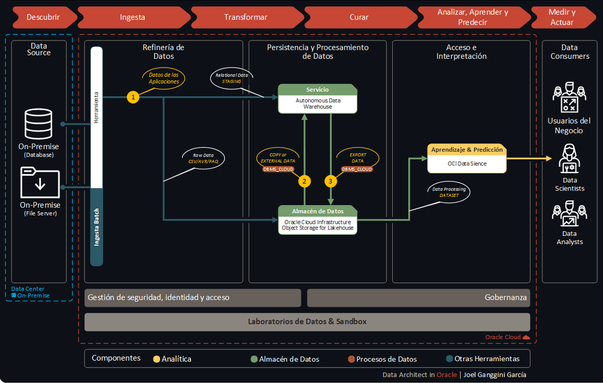
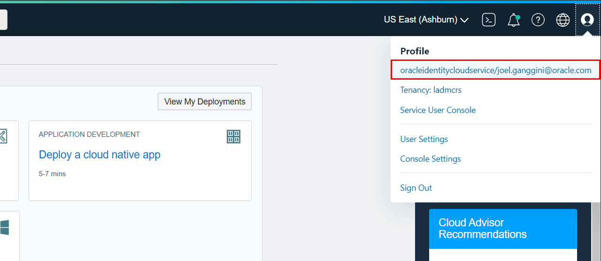
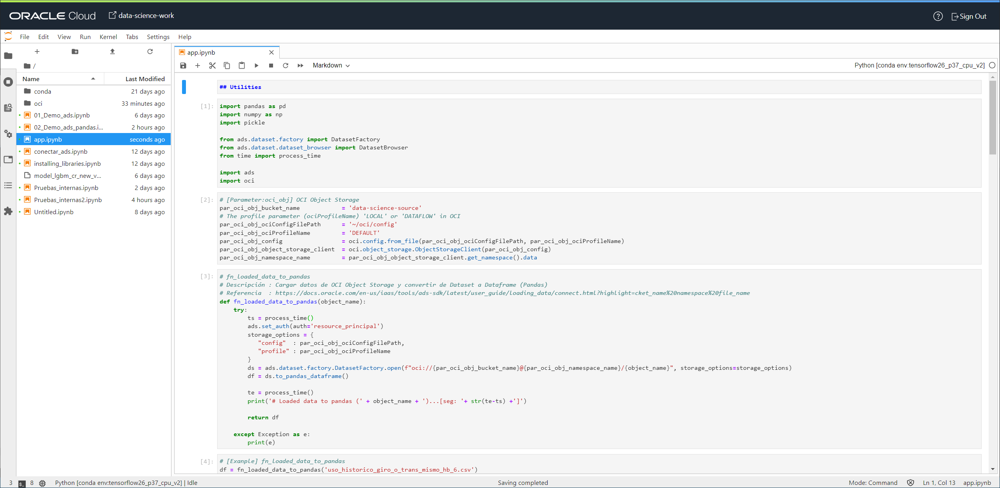

[![Issues][issues-shield]][issues-url]
[![LinkedIn][linkedin-shield]][linkedin-url]


<!-- PROJECT LOGO -->
<br />
<p align="center">
  

  <h3 align="center">OCI Data Science</h3>

  <p align="center">
    Utilitarios con ADS y OCI SDK
    <br />
    <a href="app.ipynb"><strong>Explore the code »</strong></a>
    <br />
    <br />
    <a href="https://youtube.com/playlist?list=PLMUWTQHw13gYxnjur9M-iyKJR1lhP8ghO&si=fW6WLm7VmMAd9mv9">🎬 View Demo</a>
    ·
    <a href="https://github.com/jganggini/oci/issues">Report Bug</a>
    ·
    <a href="https://github.com/jganggini/oci/issues">Request Feature</a>
  </p>
</p>


<!-- TABLE OF CONTENTS -->
<details open="open">
  <summary>Contenido</summary>
  <ol>
    <li><a href="#proyecto">Proyecto</a></li>
    <li><a href="#config">Config</a></li>
    <li><a href="#parameters">Parameters</a></li>
    <li><a href="#instalación">Instalación</a></li>
    <li><a href="#oci-data-science">OCI Data Science</a></li>
    <li><a href="#referencias">Referencias</a></li>
    <li><a href="#contacto">Contacto</a></li>
  </ol>
</details>

<!-- Proyecto -->
## Proyecto

El proyecto cubre un conjunto de casos para acelerar la interacción de datos entre diversos servicios en `Oracle Cloud Infrastructure` y las librerias mas usadas.

El siguiente diagrama ilustra esta arquitectura de referencia:

<p align="center">
    
</p>

<!-- Config -->
## Config

Los SDK y la CLI de Oracle Cloud Infrastructure requieren información de configuración básica, como las credenciales de usuario y el OCID de arrendamiento. [SDK and CLI Configuration File](https://docs.oracle.com/en-us/iaas/Content/API/Concepts/sdkconfig.htm)


<!-- Parameters -->
## Parameters

*   <u>OCI Object Storage:</u></br>
    Agregamos los parámetros para conectarnos al `Bucket` en `OCI Object Storage`:

    ```python
    # [Parameter:oci_obj] OCI Object Storage
    par_oci_obj_bucket_name            = 'data-science-source'
    # The profile parameter (ociProfileName) 'LOCAL' or 'DATAFLOW' in OCI
    par_oci_obj_ociConfigFilePath      = '~/oci/config'
    par_oci_obj_ociProfileName         = 'DEFAULT'
    par_oci_obj_config                 = oci.config.from_file(par_oci_obj_ociConfigFilePath, par_oci_obj_ociProfileName)
    par_oci_obj_object_storage_client  = oci.object_storage.ObjectStorageClient(par_oci_obj_config)
    par_oci_obj_namespace_name         = par_oci_obj_object_storage_client.get_namespace().data
    ```

    *   Creamos el directeorio `./oci/`

    *   Descargamos los siguientes archivos:
        *   oracleidentitycloudservice_joel.ganggini-11-03-16-22.pem
        *   oracleidentitycloudservice_joel.ganggini-11-03-16-22_public.pem
        *   config
                    
    *  Para ello ingresamos a nuestra cuenta de `OCI` y generamos el API Key:

       <p align="center">
         
       </p>
    
    *   El archivo `config` cuenta con el perfil `DEFAULT`. 

        ```python
        [DEFAULT]
        user=ocid1.user.oc1..****************************************************
        fingerprint=**:**:**:**:**:**:**:**:**:**:**:**:**:**:**:**
        tenancy=ocid1.tenancy.oc1..****************************************************
        region=sa-saopaulo-1
        key_file=~/oci/oracleidentitycloudservice_joel.ganggini-11-03-16-22.pem
        ```

<!-- Instalación -->
## Instalación

*   Utilice el administrador de paquetes [pip](https://pip.pypa.io/en/stable/) para instalar las siguientes librerias:

    ```bash
    pip install pandas
    pip install pickle
    ```

*  [Oracle Accelerated Data Science SDK (ADS)](https://docs.oracle.com/en-us/iaas/tools/ads-sdk/latest/index.html): El SDK de Oracle Accelerated Data Science (ADS) es una biblioteca de Python que se incluye como parte del servicio Oracle Cloud Infrastructure Data Science. `— Ya intalado`

*  [Oracle Cloud Infrastructure Python SDK](https://oracle-cloud-infrastructure-python-sdk.readthedocs.io/en/latest/index.html): Este es el SDK público de Python para Oracle Cloud Infrastructure. `— Ya intalado`

<!-- OCI Data Science -->
## OCI Data Science

  <p align="center">
    
  </p>
 

<!-- Referencias -->
## Referencias

*   [Use Python to manage directories and files in Azure Data Lake Storage Gen2](https://docs.microsoft.com/en-us/azure/storage/blobs/data-lake-storage-directory-file-acl-python)
*   [Oracle Cloud Infrastructure Documentation: SDK and CLI Configuration File:](https://docs.oracle.com/en-us/iaas/Content/API/Concepts/sdkconfig.htm)
*   [Oracle Cloud Infrastructure Documentation: put_object](https://docs.oracle.com/en-us/iaas/tools/python-sdk-examples/2.45.1/objectstorage/put_object.py.html)

<!-- Contacto -->
## Contacto

Joel Ganggini [@jganggini](https://www.linkedin.com/in/jganggini/)
Project Link: [https://github.com/jganggini/](https://github.com/jganggini/)

<!-- MARKDOWN LINKS & IMAGES -->
<!-- https://www.markdownguide.org/basic-syntax/#reference-style-links -->
[issues-shield]: https://img.shields.io/github/issues/othneildrew/Best-README-Template.svg?style=for-the-badge
[issues-url]: https://github.com/jganggini/oci/issues
[linkedin-shield]: https://img.shields.io/badge/-LinkedIn-black.svg?style=for-the-badge&logo=linkedin&colorB=555
[linkedin-url]: https://www.linkedin.com/in/jganggini/