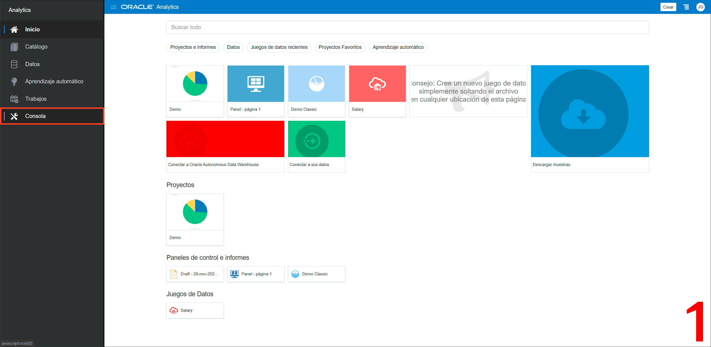

[![Issues][issues-shield]][issues-url]
[![LinkedIn][linkedin-shield]][linkedin-url]


<!-- PROJECT LOGO -->
<br />
<p align="center">
  

  <h3 align="center">OCI Email Delivery</h3>

  <p align="center">
    Enviar Correos y notificaciones desde ADW y OAC
    <br />
    <a href="app.py"><strong>Explore the code »</strong></a>
    <br />
    <br />
    <a href="https://youtube.com/playlist?list=PLMUWTQHw13gYxnjur9M-iyKJR1lhP8ghO&si=fW6WLm7VmMAd9mv9">🎬 View Demo</a>
    ·
    <a href="https://github.com/jganggini/oci/issues">Report Bug</a>
    ·
    <a href="https://github.com/jganggini/oci/issues">Request Feature</a>
  </p>
</p>


<!-- TABLE OF CONTENTS -->
<details open="open">
  <summary>Contenido</summary>
  <ol>
    <li><a href="#proyecto">Proyecto</a></li>
    <li>
        <a href="#descripción">Descripción</a>
        <ul>
            <li><a href="#config">Config</a></li>
            <li><a href="#parameters">Parameters</a></li>
        </ul>
    </li>
    <li><a href="#referencias">Referencias</a></li>
    <li><a href="#contacto">Contacto</a></li>
  </ol>
</details>

<!-- Proyecto -->
## Proyecto

Actualmente se cuenta con información en Oracle Analytics y se requiere:
Generar y compartir un informe grafico desde Autonomous Database.

Embeber en la pagina web corporativa un informe grafico de Oracle Analytics Cloud.
Compartir por email un informe creado en Oracle Analytics Cloud embebido en el correo y también con un hipervínculo al informe.

Es por ello que el equipo de desarrollo necesita habilitar los servicios necesarios para realizar esas tareas de publicación y notificaciones por email 

El siguiente diagrama ilustra esta arquitectura de referencia:

<p align="center">
    
</p>

<!-- Config -->
## Config

*   Describe cómo enviar correo usando UTL_SMTP en Autonomous Database. [Sending Mail with Email Delivery on Autonomous Database](https://docs.oracle.com/en/cloud/paas/autonomous-database/adbsa/smtp-send-mail.html#GUID-F2C7AD19-3B24-4DF0-9293-78FD98888CD0)

*   `BI Services Administrator\BI Content Author`: Para utilizar las opciones de desarrollador, debe tener privilegios de BI Services Administrator o de BI Content Author.

    Para más información: [Developer Reference](https://docs.oracle.com/en/cloud/paas/analytics-cloud/acubi/developer-reference.html#GUID-F7C0D80F-833F-446E-9DF1-11E2EEC07422)

  <p align="center">
    <a href="https://youtu.be/7Q3eScLZ3m8?si=2ut8CPK4dcsIDb7D">
      
    </a>
  </p>


<!-- Parameters -->
## Parameters

*   `sp_send_mail`: Stored procedure de envio de correos
    ```sql
    v_username      VARCHAR2(1000)   := 'ocid1.user.oc1..aaaaaaaawbh6e75h...';
    v_passwd        VARCHAR2(50)     := 'opK+2W)fmru#5Z8]erP{';
    v_msg_from      VARCHAR2(50)     := 'correo@dominio.com';
    v_mailhost      VARCHAR2(50)     := 'smtp.email.us-ashburn-1.oci.oraclecloud.com';

    l_boundary      VARCHAR2(50)     := '----=*#abc1234321cba#*=';
    v_count         INTEGER;
    v_total         INTEGER;
    v_rcpt          VARCHAR2(500);
    v_html          CLOB             := NULL;
    ```

*   `OCI Email Delivery`: Para mayor detalle

    <p align="left">
      <a href="https://youtu.be/7Q3eScLZ3m8?si=2ut8CPK4dcsIDb7D">
        
      </a>
    </p>
 

<!-- Referencias -->
## Referencias

*   [Sending Mail with Email Delivery on Autonomous Database](https://docs.oracle.com/en/cloud/paas/autonomous-database/adbsa/smtp-send-mail.html#GUID-B64E0087-5606-4B60-9D6A-CF09F22C7CEC)
*   [Example - Oracle Cloud Infrastructure Email Delivery Settings](https://docs.oracle.com/en/cloud/paas/analytics-cloud/acabi/example-oracle-cloud-infrastructure-email-delivery-settings.html)
*   [Register the Embedding Environment as a Safe Domain](https://docs.oracle.com/en/cloud/paas/analytics-cloud/acubi/register-environments.html)
*   [Embed with the JavaScript Embedding Framework](https://docs.oracle.com/en/cloud/paas/analytics-cloud/acubi/embed-javascript.html#GUID-DD102F44-83A5-44FA-A365-4A9D0D73C024)

<!-- MARKDOWN LINKS & IMAGES -->
<!-- https://www.markdownguide.org/basic-syntax/#reference-style-links -->
[issues-shield]: https://img.shields.io/github/issues/othneildrew/Best-README-Template.svg?style=for-the-badge
[issues-url]: https://github.com/jganggini/oci/issues
[linkedin-shield]: https://img.shields.io/badge/-LinkedIn-black.svg?style=for-the-badge&logo=linkedin&colorB=555
[linkedin-url]: https://www.linkedin.com/in/jganggini/